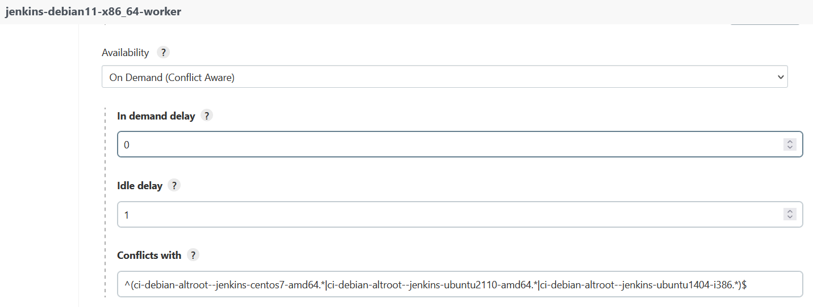

# Conflict Aware On Demand Retention Strategy plugin

## Introduction

This plugin provides an extension of the standard "On Demand" launch and
retention strategy for Jenkins build agents such as the SSH Build Agents,
limiting the resource stress on a single system hosting several such agents.

Similarly to standard functionality, this plugin supports delayed start
of an agent (if some part of a job which it can serve has been queued
longer than specified time) and a quiet down time (how long the agent
would remain active after it no longer has work, in case new jobs land
soon).

It additionally has a parameter to specify a regular expression with
other agent names which it "conflicts" with -- this allows to only
run one agent at a time, allowing a resource-constrained host system
to fulfill several scenarios in a practical build job eventually,
e.g. building and testing platform-dependent projects in numerous
environments and architectures with QEMU, as chroots, containers or
complete virtual machines.

Overall this approach can be faster than running such builds in parallel
(if CPU or I/O contention are the bottleneck), or more reliable (if RAM
availability is constrained, so builds can fail due to "Out of memory"
issues). It also allows to scale the coverage of emulated multiplatform
build systems, by defining more environments and throwing time at it
with effectively sequential build processing. Sometimes it is worth it ;)

## Getting started

To make use of this plugin, go to your persistent agent configuration
UI under `$JENKINS_URL/computer/agentname/configure`, to Availability
section. There select "On Demand (Conflict Aware)" option and set up
the fields:

* "In demand delay" can range from 0 (minutes) upwards; you can use
  it to try prioritizing one build environment over others.

* Keep "Idle delay" at a minimal value (1 minute) to quickly hand the
  host over to serving another build environment.

* "Conflicts with" specifies a regular expression to match Jenkins names
  of other agents that can run on the same host.

    It would be helpful to name agents defined on the each host with
    a unique common pattern, so you would cover all "neighbors" with
    one regular expression which you can copy around the co-located
    agent configurations, but yet not "conflict" with any Jenkins
    agents co-located on another host.

    An alternative solution can be to group guest systems for Jenkins
    agents based on expected use-cases and selected in a job by labels.
    For example, emulated QEMU runs can be a one-off test taking days
    to complete, so "native" build environments that test every commit
    quickly have a dedicated naming pattern to only "conflict each other",
    while the emulated QEMU agents would conflict everything on this
    host, and so would only start if the host is not busy.

## Issues

Report issues and enhancements in the [Jenkins issue tracker](https://issues.jenkins-ci.org/).

## Contributing

Refer to our [contribution guidelines](https://github.com/jenkinsci/.github/blob/master/CONTRIBUTING.md)

## LICENSE

Licensed under MIT, see [LICENSE](LICENSE.md)

